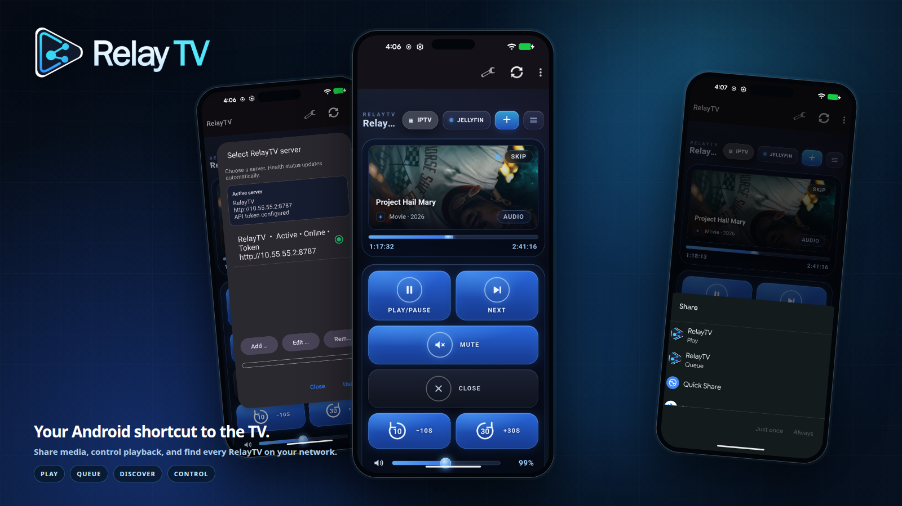
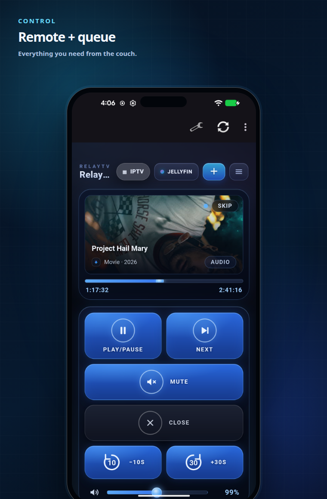
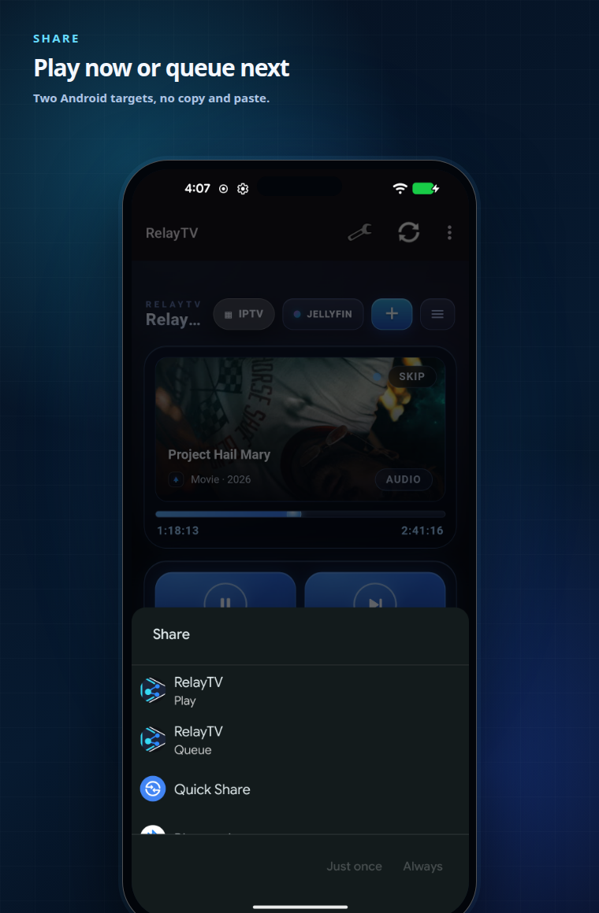
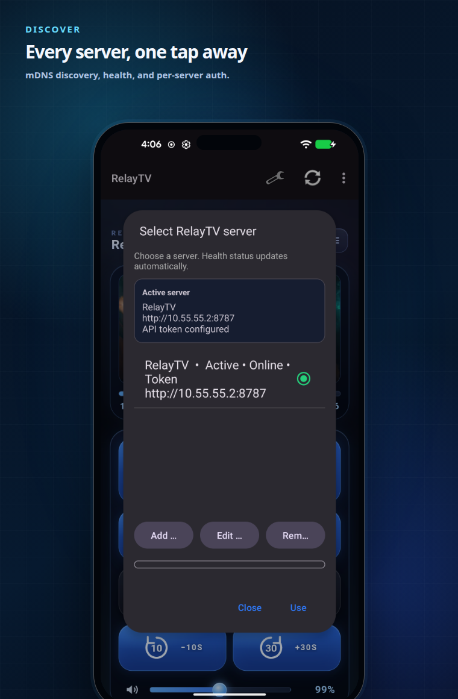
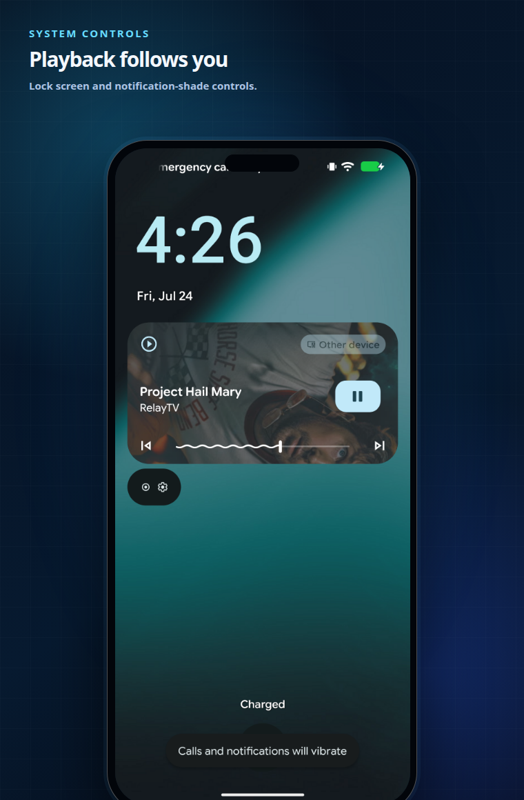

<p align="center">
  
</p>

<h1 align="center">Share it. Queue it. Watch it.</h1>

<p align="center">
  Turn your Android phone into the fastest path to your self-hosted RelayTV:
  share media from any app, control the TV, and discover every RelayTV server
  on your network.
</p>

<p align="center">
  <a href="#install-in-minutes"><strong>Install</strong></a> ·
  <a href="#see-it-in-action"><strong>See it in action</strong></a> ·
  <a href="https://github.com/mcgeezy/relaytv-android/releases"><strong>Releases</strong></a> ·
  <a href="https://github.com/mcgeezy/relaytv"><strong>RelayTV server</strong></a>
</p>

<p align="center">
  <a href="https://github.com/mcgeezy/relaytv-android/actions/workflows/ci.yml"></a>
  <a href="https://github.com/mcgeezy/relaytv-android/releases"></a>
  <a href="#compatibility"></a>
  <a href="https://github.com/mcgeezy/relaytv-ha"></a>
  <a href="https://buymeacoffee.com/relaytv"></a>
</p>

<p align="center">
  
</p>

<p align="center">
  <strong>Local-first</strong> · No RelayTV account · No tracking · Optional
  bearer-token authentication
</p>

## Your phone becomes the remote

### Send it

Share a link, video, or audio file from Android and choose **Play** to start it
now or **Queue** to put it next. No copying a URL, opening another app, or
walking back to the TV.

### Control it

Open the complete RelayTV web remote inside the app. Play, pause, seek, skip,
adjust volume, manage the queue, and browse Jellyfin, Emby, or IPTV from the
same screen. RelayTV also publishes lock-screen and quick-settings media
controls for the active server.

### Find it

RelayTV servers announce themselves over `_relaytv._tcp` mDNS. Scan the LAN,
check health, switch between multiple screens, and keep an optional API token
with each server profile.

The Android app stays lightweight while the RelayTV box beside the television
owns playback, queue advancement, history, and the display runtime.

## See it in action

<table>
  <tr>
    <td width="50%" valign="top">
      
    </td>
    <td width="50%" valign="top">
      
    </td>
  </tr>
  <tr>
    <td valign="top">
      <h3>Everything you need from the couch</h3>
      Control current playback, seek, change volume, manage the queue, and open
      the complete RelayTV library experience without switching devices.
    </td>
    <td valign="top">
      <h3>Two targets, zero friction</h3>
      Send links and compatible local audio or video files directly from the
      Android share sheet. Play immediately or queue for later.
    </td>
  </tr>
</table>

<table>
  <tr>
    <td width="50%" valign="top">
      
    </td>
    <td width="50%" valign="top">
      
    </td>
  </tr>
  <tr>
    <td valign="top">
      <h3>Every RelayTV screen, one tap away</h3>
      Keep several servers in one app, verify availability, switch active
      screens, and discover new RelayTV devices without typing an IP address.
    </td>
    <td valign="top">
      <h3>Playback controls that follow you</h3>
      RelayTV publishes the active server as an Android media session, putting
      artwork, play/pause, previous, next, and seek controls on the lock screen
      and in the notification shade.
    </td>
  </tr>
</table>

Protected servers use the same optional bearer token for WebView controls,
shares, uploads, and native media controls.

> The images above were captured from a physical Android device and composed
> with [`scripts/readme-screenshots.js`](scripts/readme-screenshots.js).

## Install in minutes

1. Install and configure a [RelayTV server](https://github.com/mcgeezy/relaytv).
2. Download the latest APK from [GitHub Releases](https://github.com/mcgeezy/relaytv-android/releases).
3. Allow installation from the browser or file manager you used to download it.
4. Open RelayTV and select **Scan LAN**, or add the server URL manually.
5. Enter the server API token only when `RELAYTV_API_TOKEN` is enabled.

The app verifies `GET /health` before saving a server. A protected server also
validates the supplied credential through `POST /auth/check`.

## Share from Android

Android presents two RelayTV targets for compatible content:

| Target | Links | Local media | Behavior |
| --- | --- | --- | --- |
| **Play** | `POST /play_now` | `POST /ingest/media/play` | Start immediately |
| **Queue** | `POST /smart` | `POST /ingest/media/enqueue` | Add to the queue |

Local sharing accepts content exposed by Android as `video/*` or `audio/*`.
The RelayTV server performs final MIME validation and ingest processing.

## Security and privacy

- The app has no RelayTV cloud account, analytics service, or advertising SDK.
- Server profiles and optional tokens stay in app-private device storage.
- Token-bearing preferences are excluded from Android backup and device transfer.
- Tokens are sent only as `Authorization: Bearer` headers to the configured server.
- HTTP remains available for trusted LAN deployments; use HTTPS or a VPN across untrusted networks.

See the [privacy policy](docs/PRIVACY_POLICY.md) for the complete data-handling
description.

## Compatibility

- Android 8.0 or newer (`minSdk 26`)
- Android 15 target (`targetSdk 35`)
- A reachable RelayTV server on a local network, VPN, or trusted HTTPS URL
- Optional `_relaytv._tcp` mDNS advertisement for automatic discovery

The current semantic version is tracked in [`version.txt`](version.txt). Gradle
derives a monotonic Android `versionCode` from its `major.minor.patch` value.

## Build and test

RelayTV Android uses Java 17, the Android SDK, and the checked-in Gradle wrapper.

```bash
./scripts/bootstrap-android.sh
./scripts/build-debug.sh
```

The debug pipeline runs a clean APK build, Android lint, and JVM unit tests.
Its APK is written to:

```text
app/build/outputs/apk/debug/app-debug.apk
```

Run instrumentation tests with an unlocked physical device or emulator:

```bash
adb devices
./scripts/test-connected.sh
```

Build the release bundle and run release lint:

```bash
./scripts/build-release.sh
```

The Android App Bundle is written to
`app/build/outputs/bundle/release/app-release.aab`. See the
[release checklist](docs/RELEASE_CHECKLIST.md) before publishing.

### Regenerate README images

Connect an unlocked device with a configured RelayTV server, then run:

```bash
npm install
npx playwright install chromium
npm run readme:screenshots -- --serial="$(adb devices | awk '$2 == "device" { print $1; exit }')"
```

The script opens RelayTV and captures the remote, server picker, Android share
chooser, and system media controls, then rebuilds the images in
`docs/images/readme`.

## Releases

Release Please maintains one rolling `chore(main): release …` pull request from
Conventional Commit titles merged into `main`. Regular pull requests run only
debug CI. When the release chore is ready:

1. Review its version bump and `CHANGELOG.md` update.
2. Wait for Android CI to pass.
3. Merge the release chore.
4. Release Please creates a draft tag and GitHub Release.
5. The signed release workflow builds, verifies, and uploads the AAB and APK.
6. The workflow publishes the draft only after every release step succeeds.

Use squash-merge titles such as `feat: add playback control` or
`fix: authenticate media uploads`. A `feat:` selects a minor release, `fix:` a
patch release, and a Conventional Commit breaking change selects a major
release. Documentation and CI commits are included in the changelog without
independently forcing a release.

For fully automatic CI on Release Please's generated pull request, configure a
fine-grained `RELEASE_PLEASE_TOKEN` Actions secret with repository contents,
issues, and pull-request write access. The workflow falls back to
`GITHUB_TOKEN`, but GitHub may require approval for workflow runs created by
that token.

Signing credentials remain in GitHub Actions secrets. The **Build Android
release** workflow also supports manual dispatch to retry an existing draft
release by tag and commit SHA.

## Companion projects

- **[RelayTV server](https://github.com/mcgeezy/relaytv)**: the local playback engine, queue, web UI, and TV runtime.
- **[RelayTV for Home Assistant](https://github.com/mcgeezy/relaytv-ha)**: media-player entities, services, dashboards, and automations.

## Project and support

RelayTV Android follows the RelayTV core project's
[GNU General Public License v3.0](https://github.com/mcgeezy/relaytv/blob/main/LICENSE).
RelayTV artwork and marks are covered by the core project's
[asset and trademark policy](https://github.com/mcgeezy/relaytv/blob/main/ASSETS.md).

If RelayTV makes your living-room setup better, you can help by
[starring the repository](https://github.com/mcgeezy/relaytv-android), sharing
it with another self-hoster, or
[supporting development](https://buymeacoffee.com/relaytv).
